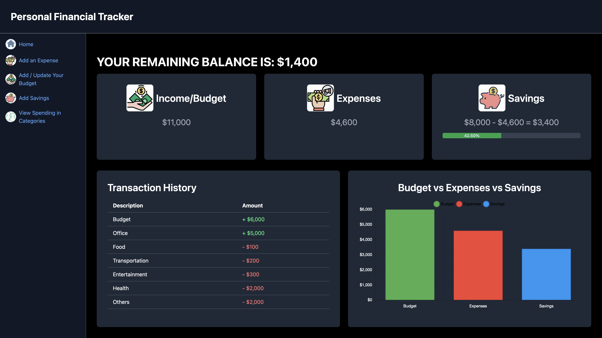

# Personal Financial Tracker

## Overview

Personal Financial Tracker is a web application designed to help users manage their personal finances. The application allows users to track their budget, expenses, income, and savings, providing visualizations to help manage their financial health.

## Table of Contents

1. [Features](#features)
2. [Installation](#installation)
3. [Usage](#usage)
4. [Screenshots] (#screenshots)
5. [API Documentation](#api-documentation)
   - [Custom Hooks](#custom-hooks)
   - [Contexts](#contexts)
6. [Contributing](#contributing)
7. [License](#license)

## Features

- Track and manage budget, expenses, and income
- Set and track savings goals
- View transaction history
- Visualize budget vs. expenses vs. savings with charts
- Responsive design for various screen sizes

## Installation

To get started with the project, follow these steps:

1. **Clone the Repository**
   git clone https://github.com/your-username/personal-financial-tracker.git

2. **Navigate to the Project Directory**
   cd personal-financial-tracker

3. **npm install**

4. **npm run dev**

   **Note**: Install the tailwind from the official website:[tailwind](https://tailwindcss.com/docs/guides/create-react-app)

## Usuage

Once the application is running, you can use the following features:

- Dashboard: Provides an overview of your financial situation including your balance, budget, total expenses, and savings. You can switch views to see different financial metrics.

- Add Expenses: Go to the "Add an Expense" page to record new expenses. Enter details like description, amount, and category.

- Update Budget: Navigate to the "Add / Update Your Budget" page to set or update your budget.

- Add Savings: On the "Add Savings" page, you can set or adjust your savings goal.

- View Spending: Check the "View Spending in Categories" page to see how your spending is distributed across various categories.

- Transaction History: View the complete list of transactions on the "Transaction History" page, including details of each expense and income.

## Screenshots

Here are some screenshots of the project in action:

Dashboard

- Overview of financial status including income,expense,balance,savings and a bar graph showing the comparison.

Add Expenses

Page for adding new expenses.

Update Budget

Page for setting or updating the budget.

Add Saving

Page for adding or adjusting savings goals.

View Spending
gi
Page for viewing spending in various categories.

Transaction History

List of all transactions with details.

## API Documentation

**Custom Hooks**

useFinancialData()

- Description: Custom hook for managing and calculating financial data, such as budget, expenses, income, balance, and savings.

**Contexts**

Budget Context

- BudgetProvider: Provides context for managing and accessing the budget.

Function

- updateBudget(newBudget): Updates the budget value with newBudget

Express Context

- Expense Provider: Provides context for managing and accessing expenses

Function

- addExpense(expense): Adds a new expense to the list of expenses

Savings Context

- SavingsProvider: Provides context for managing and accessing savings goals.

Function
**updateSavingsGoal(newGoal)**: Updates the savings goal with newGoal.

## Contributing

- Fork the Repository: Create a copy of the repository under your GitHub account.
- Clone Your Fork: Clone your fork to your local machine.
- Create a Branch: Create a new branch for your changes.
  **git checkout -b my-feature-branch**
- Make Changes: Implement your changes or new features.
- Commit and Push: Commit your changes and push them to your fork.
  **git add .**
  **git commit -m "Add new feature"**
  **git push origin my-feature-branch**
- Create a Pull Request: Open a pull request from your branch to the main repository's main branch.
